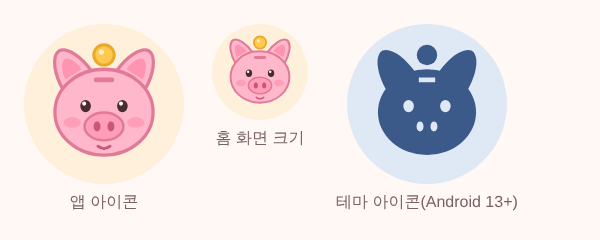

# Piggy bank

간단한 개인용 가계부 안드로이드 앱. 데이터는 기기에 저장하고, 사용자 본인의 구글 드라이브에 백업한다.



- 기능 명세: [docs/SPEC.md](docs/SPEC.md)
- Google Cloud 설정(로그인·드라이브 백업): [docs/GOOGLE_CLOUD_SETUP.md](docs/GOOGLE_CLOUD_SETUP.md)
- 릴리스 APK 만들기와 배포: [docs/RELEASE.md](docs/RELEASE.md)

## 주요 기능

- **가계부**: 월별 수입·지출·이체 기록, 한 줄 월 요약(숨기기 가능), 날짜별 묶음
- **자산**: 자산 그룹 > 세부 자산 2단계, 거래에 따라 잔액 자동 계산, 잔액 0원일 때만 삭제(기록은 유지)
- **설정**: 구글 계정 로그인(필수), 구글 드라이브 백업·복원, 자동 백업
- **보안**: 기기 DB 암호화(SQLCipher + Android Keystore), 드라이브 앱 전용 폴더만 사용, 안드로이드 자동 백업 차단

## 기술 스택

Kotlin · Jetpack Compose (Material 3) · Navigation Compose · Room + SQLCipher(DB 암호화) · DataStore · WorkManager · Google Identity(AuthorizationClient) + Drive REST API · 최소 Android 8.0 (API 26)

단위 테스트는 JUnit과 Robolectric(DB 테스트)을 쓴다.

## 빌드

Android Studio에서 프로젝트 폴더를 열고 실행하거나, 명령줄에서:

```bash
./gradlew assembleDebug        # app/build/outputs/apk/debug/
./gradlew testDebugUnitTest    # 단위 테스트
```

JDK 17 이상이 필요하다.

처음 빌드하기 전에 [Google Cloud 설정](docs/GOOGLE_CLOUD_SETUP.md)을 해 두어야 앱에서 로그인할 수 있다.

## CI

푸시할 때마다 GitHub Actions가 빌드, 단위 테스트, lint, 릴리스(R8) 빌드를 실행한다. 빌드된 디버그 APK는 Actions 실행 화면의 **Artifacts**에서 받을 수 있다. 단, CI의 디버그 APK는 임시 키로 서명되어 구글 로그인이 되지 않는다.

## 라이선스 고지

- Jua 폰트: SIL Open Font License 1.1 ([docs/licenses/Jua-OFL.txt](docs/licenses/Jua-OFL.txt))

## 보안 주의

이 저장소는 공개 저장소다. 서명 키(`*.jks`, `*.keystore`), `keystore.properties`, `local.properties`, `google-services.json`은 커밋하지 않는다(`.gitignore`에 등록됨). 앱 코드에는 클라이언트 ID나 시크릿이 없다. 구글은 패키지 이름과 서명 SHA-1로 앱을 식별한다.
